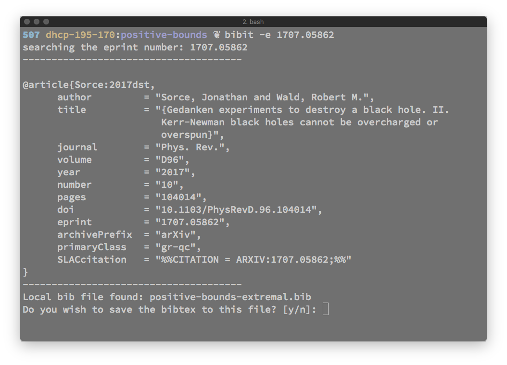

# bib-crawler

A bibtex scraper from command line



## 0. Dependencies

Python modules **requests**, **BeautifulSoup4** are required.

To install dependencies, do 

```bash
pip install requests
pip install beautifulsoup4
```


## 1. Usage

The script *bib-scrawler.sh* searches [**inspirehep**](https://inspirehep.net/) and returns the bibtex, given the title or eprint number of a paper. If a local *.bib* file is present, it will also ask if you wish to save the bibtex to the file.

To start using the script, source first

```bash
source bib-crawler.sh
```

Then you are ready to use the commands ``bibit`` and ``biball``.


#### 1.1 bibit

For most common usages,  ``bibit`` is recommended because it is fast.

- Search using the eprint number (arXiv) number of a paper

  ```shell
  bibit -e 1707.05319
  ```

- Search using the title of a paper, for instance, "on black hole entropy"

  ```shell
  bibit -t on black hole entropy
  ```


#### 1.2  biball

If ``bibit`` does not return the correct bib entry, this means more than one records have been found.  Then ``biball`` should be used.

- Search using the eprint number (arXiv) number of a paper

  ```shell
  biball -e 1707.05319
  ```

- Search using the title of a paper

  ```shell
  biball -t on black hole entropy
  ```


That's it! 


## X. License 

*This software comes with ABSOLUTELY NO WARRANTY. This is a free software, and you are welcome to redistribute it under certain conditions. See the General Public License for details.*
